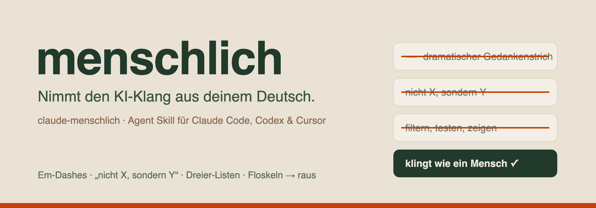

<p align="center">
  
</p>

# claude-menschlich

Ein Agent-Skill, der **AI-Slop aus deutschen Texten rausnimmt**, bevor sie live gehen. Em-Dashes, „nicht X, sondern Y"-Konstruktionen, Dreier-Listen als Reflex, hohle Überschriften, Floskel-Opener, Füllwörter, erfundene Zahlen. Die Muster, an denen man KI-Text sofort erkennt, wenn man weiß, worauf man achtet.

Es ist die deutsche Variante der Idee aus [realrossmanngroup/no_ai_slop_writing_rules](https://github.com/realrossmanngroup/no_ai_slop_writing_rules). Eigenständig auf Deutsch geschrieben, mit echten Umlauten und einem Regelset, das auf deutsche Texte passt.

## Was es macht

- **Ein Agent-Skill** (`SKILL.md`): Der Agent liest deinen Text, findet die KI-Muster und schreibt sie in natürliches Deutsch um, ohne deine Stimme zu verlieren.
- **Ein Prüfskript** (`slop_check.py`): fängt die mechanisch erkennbaren Verstöße ab (Em-Dashes bis ins Frontmatter, verbotene Phrasen, Kontrast-Parallelismus, halluzinierte Markup-Reste). Exit 1 heißt: nicht veröffentlichen.
- **Eine deutsche Muster-Referenz** (`references/banned-list.md`) zum Nachschlagen.

Das Skript ersetzt das Lesen nicht. Ton, Rhythmus und fabrizierte Zitate bleiben Handarbeit. Es macht nur die harten Regeln prüfbar.

## Installation

| Weg | Befehl |
|---|---|
| **Claude Code** (empfohlen) | `/plugin marketplace add epictaste/claude-menschlich`<br>`/plugin install menschlich@epictaste` |
| **Agent-Skills-CLI** (Codex, Cursor, …) | `npx skills add epictaste/claude-menschlich -g` |
| **Manuell** | Repo klonen, `skills/menschlich/` nach `~/.claude/skills/` kopieren |

`-g` installiert global; weglassen installiert nur ins aktuelle Projekt. Die `/plugin`-Befehle tippst du direkt in Claude Code.

## So nutzt du es

In Claude Code oder Codex sagst du einfach:

> Lauf den menschlich-Skill über meinen-artikel.md, bevor ich ihn veröffentliche.

Oder das Skript direkt:

```bash
python3 skills/menschlich/scripts/slop_check.py mein-artikel.md
python3 skills/menschlich/scripts/slop_check.py --dir ./content   # ganzer Ordner
```

Ausgabe: `OK`, `WARN` (prüfen) oder `FAIL` mit den konkreten Fundstellen. `FAIL` = Exit 1, damit du es in einen Pre-Commit-Hook oder CI hängen kannst.

## Was es fängt

- Em-Dash „—" (auch im Frontmatter) und Gedankenstrich-Drama
- Kontrast-Parallelismus: „nicht nur X, sondern auch Y", „das ist kein X, das ist ein Y"
- Dreier-Listen als Reflex, monotone Absatzlängen, Ein-Zeilen-Drama
- Floskel-Opener, Übergangs- und Schluss-Floskeln, Hype-Wörter, Füllwörter
- Halluzinierte Markup-Reste (`oaicite`, `contentReference`, …) als 100%-KI-Indikator

Die volle Liste steht in [`skills/menschlich/SKILL.md`](skills/menschlich/SKILL.md) und [`references/banned-list.md`](skills/menschlich/references/banned-list.md).

## Herkunft & Dank

Die Analyse, welche Muster KI-Text verraten, kommt aus [realrossmanngroup/no_ai_slop_writing_rules](https://github.com/realrossmanngroup/no_ai_slop_writing_rules) (englische Korpus-Auswertung über 500.000 Wörter). Dieses Repo übernimmt keine ihrer Inhalte, sondern setzt den Ansatz eigenständig für Deutsch um. Für englische Texte lohnt sich das Original.

## Lizenz

[MIT](LICENSE) © Georg Kinzel
